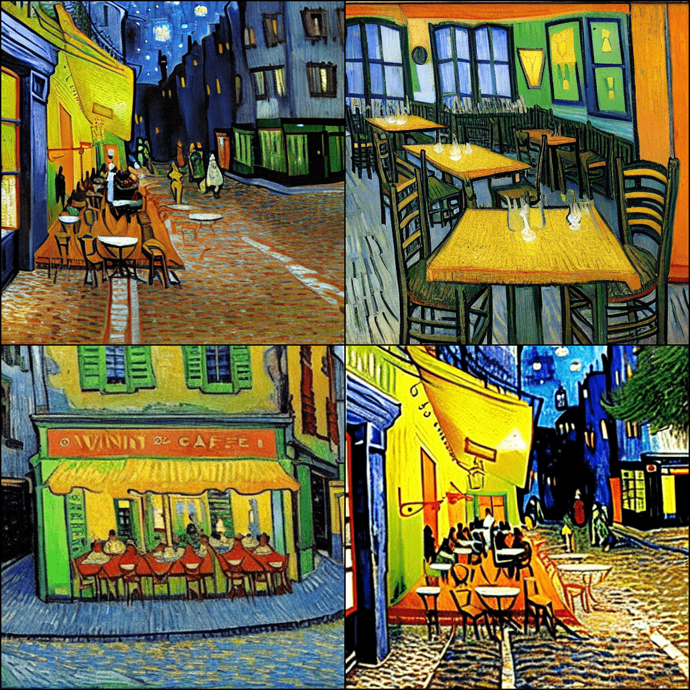
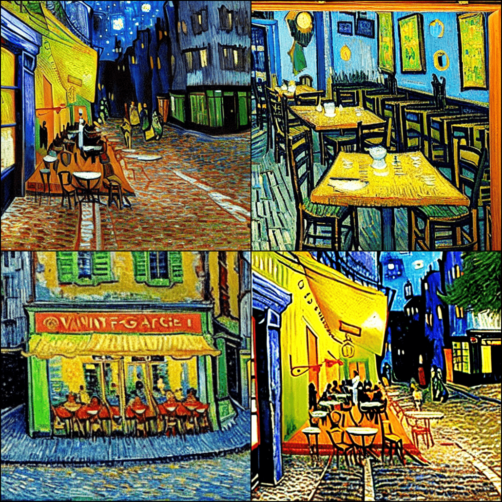

# Particle Guidance 

Implementation of Particle Guidance: non-I.I.D. Diverse Sampling with Diffusion Models by Gabriele Corso, Yilun Xu, Valentin de Bortoli, Regina Barzilay and Tommi Jaakkola.

Generative models are often sampled multiple times to obtain a diverse set incurring in a cost that is orthogonal to sampling time. To improve diversity and sample efficiency we need to move beyond the common assumption of independent samples. Particle guidance is an extension of diffusion-based generative sampling where a joint-particle time-evolving potential enforces diversity. In our manuscript analyze theoretically the joint distribution that particle guidance generates, its implications on the choice of potential, and the connections with methods in other disciplines. Here you can find the code for our empirical experiments. We test the framework both in the setting of conditional image generation, where we are able to increase diversity without affecting quality, and molecular conformer generation, where we reduce the state-of-the-art median error by 13% on average.

If you have questions, don't hesitate to open an issue or send us an email at gcorso@mit.edu and ylxu@mit.edu.

## Synthetic experiments

For our synthetic experiments on mixture of Gaussians distribution see the `synthetic.ipynb` notebook.

## Stable Diffusion

You can find all the code in the `stable_diffusion` folder.

### Running visualization

The code depends on PyTorch >= 1.2, numpy, and matplotlib. It has been tested on both Python 3.9. Please make sure you're logged in with `huggingface-cli login` , in order to download the Stable Diffusion-1.5 model.

|                   I.I.D.                    |                  Particle Guidance (pixel)                   |                 Particle Guidance (feature)                  |
|:-------------------------------------------:| :----------------------------------------------------------: | :----------------------------------------------------------: |
|  |  |  |

We've integrated the (1) vanilla i.i.d. sampling; (2) Particle Guidance (pixel); (3) Particle Guidance (feature) in the new pipeline `./diffuser/pipelines/stable_diffusion/pipeline_stable_diffusion_particle.py`

**See `particle_guidance_demo.ipynb` for the procedures to produce the visualizations in the paper.** Feel free to try your own prompts :rocket:


### Quantitative comparison

#### 1. Data processing:

- Step 1: Follow the instruction on top of `data_process.py`
- Step 2: Run `python3 data_process.py` to randomly sampled 5K image-text pair from COCO validation set.

#### 2. Generation

```sh
torchrun --rdzv_endpoint=0.0.0.0:1201 --nproc_per_node=8 generate_particle.py 
	--save_path: path to save images
	--w: classifier-guidance weight 
	--name: name of experiments
	--dino: doing particle guidance in the DINO feature space
	--coeff: coefficient of the particle guidance term (0: i.i.d.)
```

#### 3. Evaluation (Aesthetic score, CLIP score,  in-batch similarity score)

```shell
python3 eval_clip_score_particle.py  --dir_path {path}

path: path to the directory of generated image
```


## Molecular Conformer Generation 

You can find the code for running Particle Guidance on Torsional Diffusion directly integrated in the [torsional diffusion code repository](https://github.com/gcorso/torsional-diffusion). To run the particle guidance sampling with torsional diffusion to replicate the results of the paper (similarly you can run on your own molecules).

For the permutation invariant kernel guidance (higher quality, slower):

    # minimizing recall error
    python generate_confs.py --tqdm --batch_size 128 --no_energy --inference_steps=20 --model_dir=workdir/drugs_default --test_csv=data/DRUGS/test_smiles.csv --pg_invariant=True --pg_kernel_size_log_0=1.7565691770646286 --pg_kernel_size_log_1=1.1960868735428605 --pg_langevin_weight_log_0=-2.2245183818892103 --pg_langevin_weight_log_1=-2.403905082248579 --pg_repulsive_weight_log_0=-2.158537381110402 --pg_repulsive_weight_log_1=-2.717482077162461 --pg_weight_log_0=0.8004013644746992 --pg_weight_log_1=-0.9255658381081596
    # minimizing precision error
    python generate_confs.py --tqdm --batch_size 128 --no_energy --inference_steps=20 --model_dir=workdir/drugs_default --test_csv=data/DRUGS/test_smiles.csv --pg_invariant=True --pg_kernel_size_log_0=-0.9686202580381296 --pg_kernel_size_log_1=-0.7808409291022302 --pg_langevin_weight_log_0=-2.434216242826782 --pg_langevin_weight_log_1=-0.2602238633333869 --pg_repulsive_weight_log_0=-2.0439285313973237 --pg_repulsive_weight_log_1=-1.468234554877924 --pg_weight_log_0=0.3495680598729498 --pg_weight_log_1=-0.22001939454654185


For the non-permutation invariant kernel guidance (faster, slightly lower quality, but still better than I.I.D.):

    # minimizing recall error
    python generate_confs.py --tqdm --batch_size 128 --no_energy --inference_steps=20 --model_dir=workdir/drugs_default --test_csv=data/DRUGS/test_smiles.csv --pg_kernel_size_log_0=2.35958 --pg_kernel_size_log_1=-0.78826 --pg_langevin_weight_log_0=-1.55054 --pg_langevin_weight_log_1=-2.70316 --pg_repulsive_weight_log_0=1.01317 --pg_repulsive_weight_log_1=-2.68407 --pg_weight_log_0=0.60504 --pg_weight_log_1=-1.15020
    # minimizing precision error
    python generate_confs.py --tqdm --batch_size 128 --no_energy --inference_steps=20 --model_dir=workdir/drugs_default --test_csv=data/DRUGS/test_smiles.csv --pg_kernel_size_log_0=1.29503 --pg_kernel_size_log_1=1.45944 --pg_langevin_weight_log_0=-2.88867 --pg_langevin_weight_log_1=-2.47591 --pg_repulsive_weight_log_0=-1.01222 --pg_repulsive_weight_log_1=-1.91253 --pg_weight_log_0=-0.16253 --pg_weight_log_1=0.79355

